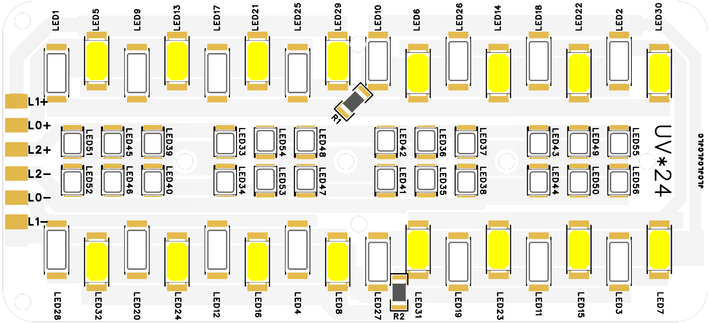

### LED控制器
* 源码地址 https://github.com/ClimbSnail/LedController
* 硬件开源地址 https://oshwhub.com/climbsnail/ledcontroller
* 教程链接，一定要先看 https://docs.qq.com/doc/DQW5FanFkSkZadWZt

### LED控制器功能介绍
1. 控制器可同时驱动4组LED的驱动板。每路最高可驱动30V4A灯珠（理想情况）。
2. 控制器集成了常见的色温控制、亮度控制、RGB色彩控制，需要搭配对应功能的灯板。可自行绘制灯板。
3. Typec接口使用CH224K实现PD诱骗，可跳线设置诱骗电压。也可直接接入5-20V的直流稳压电。
4. 集成温控系统，实时读取灯板温度，控制风扇进行主动散热。
5. 拥有联网控制的功能，可通过Web网页设置功能，远程开关，定时开关机，支持mqtt与焊台联动。 

##### LED控制器

##### LED灯板

##### 实物图

### 芯片文档
1. ESP32-C3 硬件设计指南 https://docs.espressif.com/projects/esp-hardware-design-guidelines/zh_CN/latest/esp32c3/index.html
2. 技术规格书 file:///D:/Download/esp32-c3_datasheet_cn.pdf
3. 技术参考手册 file:///D:/Download/esp32-c3_technical_reference_manual_cn.pdf

### LED控制器操作逻辑（固件v1.2.0及以上）
*  __正常模式开机：关机状态下，按住`旋钮编码器`中键约0.5s后松开即可开机。__ 如果按的时间长可能伴随着灯闪烁，只要闪烁次数在3次内即可进入该模式。该模式同时会连接设置的wifi网络，如果未设置或者无法连接设置的网络，则会默认连接名为`Snail`密码为`12345678`的wifi（故可用手机开热点测试）。
*  __低亮度模式开机：关机状态下，按住`旋钮编码器`中键约4s后松开即可（前0.5s正常开机，之后闪烁3~5次即可松手）。__ 该模式与 __`正常模式开机`__ 的区别在于，该模式以最低亮度启动（不超过0.6W）。该模式用于避免适配器功率不足导致无法正常开机，进而无法调节亮度导致的死循环。
*  __启动配置模式开机：关机状态下，按住`旋钮编码器`中键约7s后松开即可（前0.5s正常开机，之后闪烁6~9次即可松手）。__ 该模式与 __`正常模式开机`__ 的区别在于，该模式启动时，也会开启名为`LedController`的无密码热点并启用网页配置服务。此时你的电脑可搜索到该热点网络，使用浏览器登录`192.168.4.1`页面来配置LED控制器。注：配置页面最好使用电脑来操作，移动端兼容性不高。
*  __关机：开机状态下，长按`旋钮编码器`中键2s以上。__
*  __重置系统：关机状态下，按住`旋钮编码器`中键12s以上再松手。__ LED灯工作过程：前0.5s会开机，此后每隔1s闪灯一次，闪烁次数超过10次即可松手（12次、13次20次均有效，因为已达12s要求），此时灯会快速闪烁10次后自动关机。再次手动开机即可得到重置后的系统。
*  __调节功能操作如下__ ：
  
1. 控制器支持多种模式，目前适配两种灯板  __`单色光+RGB`__ （固件默认）、  __`可调色温+UV`__ ，灯板适配可在`网页配置`中更改。`单色光+RGB`灯板支持`单色光模式`和`RGB模式`，`可调色温+UV`灯板支持`色温CCT模式`和`UV模式`。长按`旋钮编码器`中键松开（0.8s以上），控制器在灯板支持的模式下循环切换。
2. 短按一下`旋钮编码器`中键(不超过0.8s)，控制器将切换当前模式下的调节内容，调节内容分两级（一级亮度、二级其他）。所有模式的一级调节项均为亮度，二级调节项为各自独有的参数（单色灯、UV灯只有一级调节项），例如色温模式的二级调节项为色温值、RGB模式的二级调节项为RGB色彩值。切换成功后，若当前调节项为一级亮度调节则灯会闪烁一下。若当前是二级调节项（色温值、RGB值），则灯会闪烁两下。
3. `旋钮编码器`转动可设置当前模式下的调节内容。例如：当前为色温模式，且正在调节的为亮度操作，转动编码器，亮度会变亮或暗。

### 关于温控风扇
* 当灯板上ntc探头测温高于45度（默认值）时会根据温度差输出相应大小的风量。
* 当灯板上ntc探头测温低于35度（默认值）时风扇全面停转。

### 关于焊台联动（固件v1.3.0及以上）
* 只有核心板为S3的蜗牛台（即三车Pro版本），焊台固件版本不小于`v2.4.1001`才可支持，并且需要确保焊台连上家中的Wifi。
* __启动配置模式开机__ ，在`网页配置`中，将你所搭配的`15或16位蜗牛台机器码`填入到`焊台联动码`中，保存后,手动重启LED补光灯即可完成联动设置。LED补光灯必须 __正常模式开机__，等待联网完成后才能接收到焊台联动信号。注：如果不想要LED补光灯拥有联动功能，则可以在`焊台联动码`中填写任意字符（不要填写机器码即可）。
* 焊台`关机20s后`或者进入`全休眠状态（锁屏状态）`，LED补光灯将会熄灭。此时可以通过按压或拨动LED补光灯编码器使之再次亮起。注：可以通过设置焊台的`锁屏延时`来加快进入锁屏状态。
* 焊台开机或者从`锁屏状态`退出到`工作状态`，LED补光灯将会亮起。

### 关于用户数据
若使用正确的关机操作，关机前会保存下当前用户的操作设置。为体谅用户直接拔数据线的习惯，控制器每隔5s也会自动保存一次用户设置的数据，大体上优化了体验。